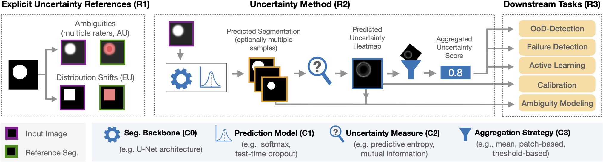

# ValUES: A Framework for Systematic Validation of Uncertainty Estimation in Semantic Segmentation

<p align="center">
  
</p>

---

> Uncertainty estimation is an essential and heavily-studied component for the reliable
> application of semantic segmentation methods. While various studies exist
> claiming methodological advances on the one hand, and successful application
> on the other hand, the field is currently hampered by a gap between theory and
> practice leaving fundamental questions unanswered: Can data-related and modelrelated
> uncertainty really be separated in practice? Which components of an uncertainty
> method are essential for real-world performance? Which uncertainty
> method works well for which application? In this work, we link this research
> gap to a lack of systematic and comprehensive evaluation of uncertainty methods.
> Specifically, we identify three key pitfalls in current literature and present
> an evaluation framework that bridges the research gap by providing 1) a controlled
> environment for studying data ambiguities as well as distribution shifts,
> 2) systematic ablations of relevant method components, and 3) test-beds for the
> five predominant uncertainty applications: OoD-detection, active learning, failure
> detection, calibration, and ambiguity modeling. Empirical results on simulated as
> well as real-world data demonstrate how the proposed framework is able to answer
> the predominant questions in the field revealing for instance that 1) separation of
> uncertainty types works on simulated data but does not necessarily translate to
> real-world data, 2) aggregation of scores is a crucial but currently neglected component
> of uncertainty methods, 3) While ensembles are performing most robustly
> across the different downstream tasks and settings, test-time augmentation often
> constitutes a light-weight alternative.

<p align="center">
  
</p>

Framework for systematic validation of uncertainty methods in segmentation. With
our framework, we aim to overcome pitfalls in the current validation of uncertainty methods for
semantic segmentation by satisfying the three requirements (R1-R3) for a systematic validation: We
explicitly control for aleatoric and epistemic uncertainty in the data and references (R1). We define
and validate four individual components C0-C3 of uncertainty methods (R2): First, one or multiple
segmentation outputs are generated by the segmentation backbone (C0) and the prediction model
(C1). Next, an uncertainty measure is applied (C2) producing an uncertainty heatmap, which can be
aggregated using an aggregation strategy (C3). Finally, the real-world capabilities of methods need
to be validated on various downstream tasks (R3).

## Reproducibility

The following sections contain instructions on how to reproduce our results

### Setup

The code is tested with python version 3.10.

1. Clone this repository
2. Install the requirements
   ```
   pip install -r requirements.txt
   ```

### Structure of this repository

This repository consists of three main parts which are in separate folders:

- datasets: This folder contains all the code to set up the datasets. This includes the used toy dataset    (toy_data_generation), the lung nodule dataset (lidc-idri) and the GTA5 / Cityscapes dataset (gta_cityscapes).
- uncertainty_modeling: This folder contains the main part for training and inference of the various 
  uncertainty methods.
- evaluation: This folder contains the code for analysis of the experiments that is done after the inference, 
  e.g. aggregation of uncertaintiy maps, OoD detection performance, AURC etc.

### Running instructions

Each subfolder contains separate README files with instructions how to reproduce the datasets, network training and inference, as well as experiment analysis, respectively.

## Acknowledgements

Acknowledgements are excluded for reasons of anonymity.

