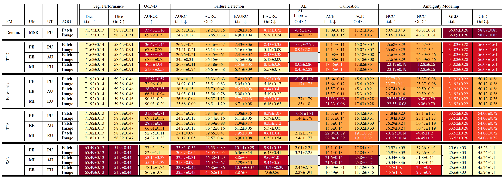
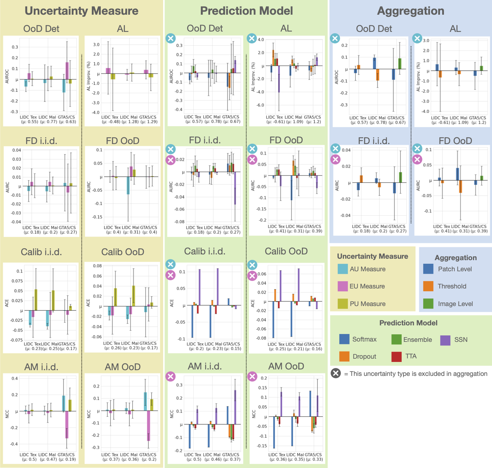

# Evaluation of predicted uncertainties on various downstream tasks

This folder contains the necessary code for evaluating the predicted uncertainty estimates on different downstream tasks.
This mainly consists of the following parts:
1. Perform some initial processing steps that are necessary for the subsequent analysis steps
2. Calculate the metrics for the different downstream tasks
3. Create tables that show all the metrics for the various downstream tasks with color coding according to the performance
4. Create barplots that aggregate various dimensions to analyse the different components of the uncertainty methods

The first two parts can thereby be performed with the ```eval_experiments.py``` script, 
whereas the functionality for visualization is implemented in the visualization subfolder with ```ds_task_tables.py``` and
```ds_tasks_barplots.py``` for parts 3 and 4, respectively.
Examples for configuration files that contain all dataset specific configurations and tasks can be found in the configs subfolder.
The following sections will give an overview over the different evaluation possibilities and the config structure in more detail.

## Initial processing and metrics calculation for the different downstream tasks
The initial processing of the uncertainty maps and the metrics calculation are all performed in the ```eval_experiments.py``` script.

To be able to analyse all downstream tasks, first the predicted uncertainty maps have to be processed in a way to be 
usable for the downstream tasks. This includes:
- Finding an appropriate threshold if threshold aggregation is performed 
- Aggregating the uncertainty maps
- Generate split files for the second cycle

Afterwards, the metrics for the different downstream tasks can be calculated. 
Note that for most of the metrics, the aggregation step in the preprocessing is necessary
and also for the AL improvement, a second cycle of training has to be performed using the generated split files from above.
The following downstream tasks with their respective metrics can be evaluated:
- OoD-Detection: AUROC
- Failure Detection: AURC and E-AURC
- AL Improvement: Relative AL Improvement in terms of Dice score compared to first cycle training
- Calibration: ACE
- Ambiguity Modeling: NCC

Note, that for the Segmentation Performance, the Dice score is already calculated directly in the inference.
There, also the Generalized Energy Distance (GED) is calculated as a further measure of ambiguity modeling.

The following sections will explain the structure of the config files and outputs for these analysis steps.

### Config files structure metrics

In the config folder, some examples for configs for the different initial processing steps and downstream task metrics are shown for different datasets.  
The entry points for these config files are the ```eval_config_<dataset>.yaml``` files. These have roughly this structure

```yaml

defaults:
	- _self_
	- <file imports>

base_path: <path/to/first/cycle/exp/root/dir>
second_cycle_path: <path/to/second/cycle/exp/root/dir>
experiments:
# list with dataset specific configs for base_path, i.e. how to construct different experiment versions etc.
	- <experiment dataset key>

tasks: [<list of tasks that should be executed>]

task_params:
	<task_name>:
		datasets: [<list of dataset splits the task is evaluated on, i.e. val / id / ood / unlabeled>]
		function:
			_target_: <python function that solves the task>
			# Additional input params that the function in _target_ takes
			param1: value1


```

The dataset specific structure under experiment defines the way the different namings of the experiment versions is built and can define additional dataset specific things, like e.g. how the segmentations are loaded (especially look at ```gta.yaml``` for such special configs). Further, the prediction models are defined that were analyzed for this dataset. The structure is roughly like this:

```yaml
DATASET KEY:
	# all the parameters that differ between experiment versions that should be iterated
	iter_params:
		pred_model: [<list of prediction models to iterate as exp versions>]
		seed: [<list of seeds to iterate as exp versions>]
		...
	# all other parameters that are specific for an experiment version
	fold: <training fold>
	rank: <rank (specific for SSNs)>
	image_ending: <file ending of image files>
	unc_ending: <file ending of uncertainty maps>
	n_reference_segs: <number of reference segmentations>

	pred_models:
		<pred_model_name>:
			naming_scheme_version: <how are versions of these pred models experiments named>
			unc_types: [<list of unc types that are considered for this pred model>]
			aggregations: [<list of aggregations that are considered for this pred model>]
		...

```

### Outputs structure

The json scheme below shows the output format of the results.  
Note, that for some metrics (e.g. AUROC), no single \<image_id\> metrics are available, so only one "mean" key exists. Further, metrics that do not consider aggregation (e.g. NCC) do not have aggregation keys and metrics that also do not consider uncertainty types (i.e. Dice and GED) also do not have uncertainty keys.

```json
{
	<image_id1>:{
		<uncertainty_type>:{
			<aggregation1>: 		
				metrics:{
					<metric>:<value>
				}
			<aggregation2>:
				metrics:{
					<metric>:<value>
				}
		}
	<image_id2>:{
		<uncertainty_type>:{
			<aggregation1>: 		
				metrics:{
					<metric>:<value>
				}
			<aggregation2>:
				metrics:{
					<metric>:<value>
				}
		}
	}
  ...
	mean:{
		<uncertainty_type>:{
			<aggregation1>: 		
				metrics:{
					<metric>:<value>
				}
			<aggregation2>:
				metrics:{
					<metric>:<value>
				}
		}
	}
}
```

## Visualizations
There are currently two ways to display the results of the different downstream tasks: either as detailed table with all combinations of prediction model, uncertainty type and aggregation or as barplots that focus on one dimension of the uncertainty method and aggregate along the others.  
The table is thereby printed as latex code. Compiled in latex, it looks like this (for the GTA dataset, columns slightly manually renamed):





The aggregated barplots look like this:  


  


These visualizations can be created with the ```ds_task_table.py``` and ```ds_task_barplots.py``` scripts in the visualizations subfolder. These files again take some yaml configuration, of which the structure is explained in the following section.

### Config files structure table/plots

Below, the structure for the config files to display the table with the results is shown. The experiments list is the same as for [calculating the metrics](#config-files-structure-metrics).

```yaml
defaults:
	- _self_
	- <file imports>

base_path: <path/to/first/cycle/exp/root/dir>
experiments:
# list with dataset specific configs for base_path, i.e. how to construct different experiment versions etc.
	- <experiment dataset key>

# in the example yaml files, this is in a separate file (imported in defaults)
ds_tasks:
	<task1_name>:
		<metric1_name>:
			metrics_file_name: <metrics.json>
			metrics_key: <metrics name in json>
			dataset_split: [<list of dataset splits the metric was calculated on, i.e. unlabeled, id, ood]
			levels: [<list of uncertainty methods to consider for this metric, i.e. pred_model, unc_type, aggregation>]
			higher_better: <bool if higher score means better performance>
		<metric2_name>:
			...
	<task2_name>:
		...
```

The config structure to create the barplots that aggregate over certain dimension have the following structure:

```yaml
defaults:
	- _self_
	- <table_config_1>
	- <table_config_2>
	...
	- <other file imports>

save_path: <path/to/save/plots>

# change names of df how they should be displayed in plots, optional
df_naming:
	<df_1>: <name to display in plot>

# change the color of certain bars in the plot, optional
coloring:
	<unc method component>:
		<value_1>: <color>
		...

# change the order of certain bars along one component, optional
ordering:
	<unc method component>: [<list with desired order>]


# in the example yaml files, this is in a separate file (imported in defaults)
ds_tasks:
	<task1_name>:
		<metric1_name>:
			metrics_file_name: <metrics.json>
			metrics_key: <metrics name in json>
			dataset_split: [<list of dataset splits the metric was calculated on, i.e. unlabeled, id, ood]
			levels: [<list of uncertainty methods to consider for this metric, i.e. pred_model, unc_type, aggregation>]
			higher_better: <bool if higher score means better performance>
			filter:
				<unc component where to filter>:
					<unc components to not include in aggregation>: [<list of components>]
					...
				...
		<metric2_name>:
			...
	<task2_name>:
		...
```

The ```ds_tasks``` key is similar to the configuration of the table, except that it contains a ```filter``` key. With this, it is possible to exclude some components when aggregating along a specific axis. E.g. when it doesn't make sense to consider epistemic uncertainty in a downstream task as competitive uncertainty method, it should be excluded when aggregating to see which prediction model performs best. The filter for this would look like this:

```yaml
filter:
	pred_model:
		unc_type: ["epistemic_uncertainty"]
```

